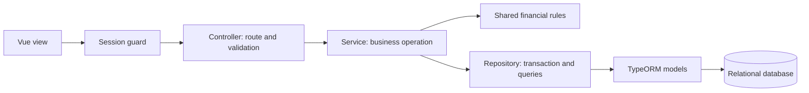
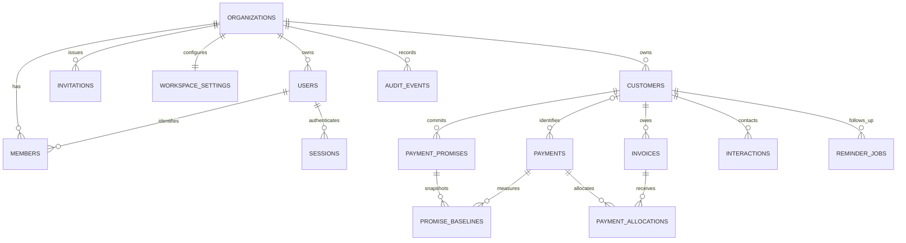

# Revora backend and database

The NestJS backend is organized by layer. Each layer has one directory, and related files use descriptive names. Vue in `../src` provides the view layer; the backend returns JSON.

## Folder structure

```text
server/
  main.ts                   HTTP startup and middleware
  app.module.ts             Application composition
  tsconfig.json             Editor-discoverable decorator configuration
  controllers/              All HTTP controllers
  services/                 Account, session, invitation, workspace, database, and worker services
  models/                   All TypeORM database models and the entity registry
  repositories/             All queries, transactions, and workspace row mapping
  dto/                      Validated request/response contracts
  interfaces/               Authenticated request and assembled workspace interfaces
  guards/                   Session authentication
  filters/                  API error handling
  modules/                  Nest dependency registration
  utils/                    Password and token hashing
  migrations/               Versioned schema and data migrations
  database/                 Connection configuration and migration CLI
```

Start with [workspace.controller.ts](controllers/workspace.controller.ts), then [workspace.service.ts](services/workspace.service.ts), and [workspace.repository.ts](repositories/workspace.repository.ts).

[workspace-database.mapper.ts](repositories/workspace-database.mapper.ts) translates between database rows and the workspace object used by the application. `loadWorkspaceFromDatabase()` reads the tables and assembles that object; `saveWorkspaceToDatabase()` converts the updated object into rows and saves the changes. This mapper also performs database reads and writes, so it stays in `repositories/`. Its callers manage transactions and revision checks.



Controllers validate raw input with Zod and call services. Services coordinate permissions and business rules. Repositories own database access. Models declare columns, composite keys, foreign keys, checks, and indexes. ESLint enforces these boundaries. Module files wire the layers together.

Authentication resolves the session, user identity, and current organization membership through `AuthRepository.findAuthenticatedSession()`. It does not load invoices, payments, or the full workspace to authenticate each request. The workspace mapper groups allocations and promise baselines once, preserving list order while avoiding repeated table-array scans. `GET /api/workspace/records/:kind` provides bounded cursor pages for customers, invoices, and payments. The frontend uses a small bootstrap and these pages until a screen or action requires a complete workspace. Collections, credit, activity, and server overview calculations still need bounded database reads.

## Separate tables

Development fixtures and role-specific login accounts are available through `yarn db:seed`. Stop the backend first. See [SEED_GUIDE.md](../SEED_GUIDE.md) for credentials, permission scenarios, and repeat-run behavior. The CLI is in `database/seed.ts`, fixtures in `database/development-fixtures.ts`, and transactional inserts in `repositories/development-seed.repository.ts`.

There is no workspace JSON column. Every collection is persisted in its own table. `WorkspaceRecord.data` is an assembled, typed response object created from table reads; it is not a database field.

| Table                                               | Model file                                                                | Stores                                                                                 |
| --------------------------------------------------- | ------------------------------------------------------------------------- | -------------------------------------------------------------------------------------- |
| `organizations`                                     | [organization.model.ts](models/organization.model.ts)                     | Business name, currency, timezone, and concurrency revision                            |
| `users`                                             | [user.model.ts](models/user.model.ts)                                     | Login identity and password hash                                                       |
| `members`                                           | [member.model.ts](models/member.model.ts)                                 | Organization/user membership and role; name/email come from the user                   |
| `sessions`                                          | [session.model.ts](models/session.model.ts)                               | Hashed session tokens, user reference, expiry, demo flag                               |
| `invitations`                                       | [invitation.model.ts](models/invitation.model.ts)                         | Hashed invitation tokens, organization, email, role, expiry                            |
| `password_resets`                                   | [password-reset.model.ts](models/password-reset.model.ts)                 | One-use hashed recovery tokens and expiry                                              |
| `command_receipts`                                  | [command-receipt.model.ts](models/command-receipt.model.ts)               | Transactional request IDs, payload hashes, and committed revisions                     |
| `workspace_settings`                                | [workspace-settings.model.ts](models/workspace-settings.model.ts)         | One row per organization for reminder rules and template                               |
| `customers`                                         | [customer.model.ts](models/customer.model.ts)                             | Business/contact fields, payment terms, status, approved credit limit                  |
| `invoices`                                          | [invoice.model.ts](models/invoice.model.ts)                               | Customer reference, invoice number, dates, amount, allocated-paid total, stored status |
| `payments`                                          | [payment.model.ts](models/payment.model.ts)                               | Receipt details, bank/reference, amount, optional customer, status                     |
| `payment_allocations`                               | [payment-allocation.model.ts](models/payment-allocation.model.ts)         | Individual amounts linking a payment to an invoice                                     |
| `payment_promises`                                  | [payment-promise.model.ts](models/payment-promise.model.ts)               | Customer commitment, amount, deadline, status, note                                    |
| `promise_baselines`                                 | [promise-baseline.model.ts](models/promise-baseline.model.ts)             | Payment allocation totals already present when a promise was created                   |
| `interactions`                                      | [interaction.model.ts](models/interaction.model.ts)                       | Customer contact history, author, channel, direction, outcome, next action             |
| `reminder_jobs`                                     | [reminder-job.model.ts](models/reminder-job.model.ts)                     | Queued/prepared/cancelled reminder text and scheduling metadata                        |
| `audit_events`                                      | [audit-event.model.ts](models/audit-event.model.ts)                       | Actor, time, action, description, and referenced entity identifier                     |
| `invoice_corrections`                               | [invoice-correction.model.ts](models/invoice-correction.model.ts)         | Internal adjustments and credit notes with reasons and actor history                   |
| `write_off_requests`                                | [write-off-request.model.ts](models/write-off-request.model.ts)           | Two-person write-off requests and review decisions                                     |
| `bank_reconciliations`                              | [bank-reconciliation.model.ts](models/bank-reconciliation.model.ts)       | Statement totals and reconciliation exceptions                                         |
| `worker_leases`                                     | [worker-lease.model.ts](models/worker-lease.model.ts)                     | Cross-instance reminder scheduler coordination                                         |
| `customer_territories`                              | [customer-territory.model.ts](models/customer-territory.model.ts)         | Explicit Sales member assignment by customer                                           |
| `whatsapp_consents`                                 | [whatsapp-consent.model.ts](models/whatsapp-consent.model.ts)             | Recorded customer permission for automated reminders                                   |
| `whatsapp_deliveries`                               | [whatsapp-delivery.model.ts](models/whatsapp-delivery.model.ts)           | Provider message ID, delivery state, and claim token                                   |
| `whatsapp_webhook_events`, `whatsapp_status_events` | [whatsapp-webhook-event.model.ts](models/whatsapp-webhook-event.model.ts) | Dedupe incoming messages and retain out-of-order delivery events                       |

TypeORM also maintains its `migrations` bookkeeping table.



Names such as salesperson, interaction author, and audit actor remain historical text fields. Territory assignment separately uses authenticated member IDs. Audit `entityId` can identify several kinds of record, so it is not a foreign key to one table. Credit decisions are represented in audit events and the customer's current approved limit.

## Integrity and transaction rules

- Financial records use composite keys containing `organizationId`. Demo workspaces can safely reuse fixture IDs without sharing rows.
- Customer relationships include the organization ID. Allocation foreign keys also include customer ID, so the payment and invoice must belong to the same organization and customer.
- Unidentified payments store `customerId = NULL`. The API still returns the existing empty-string representation for compatibility.
- Customer names and invoice numbers have organization-scoped normalized unique keys. Payments have a unique organization/bank/normalized-reference key.
- Money uses `bigint` columns in integer paisa. A typed transformer converts PostgreSQL bigint strings to safe JavaScript integers, enforcing the application's amount bounds. SQLite uses integer storage for these values.
- Database checks reject negative/out-of-range money, invalid stored statuses, paid amounts above invoice amounts, invalid terms, and invalid scheduling limits. Services retain cross-row rules, such as available payment amount and invoice eligibility.
- Financial saves first compare and increment the organization revision, then update changed rows and the audit entry in the same transaction. Failures roll everything back. Unchanged rows are not rewritten and the tables are not cleared/reinserted on each save.
- Allocations remain as historical records when a payment is reversed. The payment status, invoice paid totals, and promise statuses change transactionally.
- No generic financial-record deletion is provided. Foreign keys restrict deleting referenced records; removing ledger rows requires a dedicated domain operation.
- SQL.js uses one connection, so the database service serializes transactions. PostgreSQL uses its transaction manager and repeatable-read transactions when assembling multi-table snapshots.

Each persisted list has a `sortOrder` column to preserve existing UI ordering during migration. The browser still receives one assembled workspace snapshot; normalization changes storage without breaking the frontend API. The reminder worker selects only organizations with enabled reminders or queued jobs and uses a renewable database lease. Record pages use cursor queries and indexes; the dashboard and mutations still load a full workspace.

## Migrations and existing data

Schema synchronization is disabled. `DB_SYNCHRONIZE` is no longer used. The versioned migration creates the tables and converts the legacy `organization.data` aggregate if it exists.

For an existing database, the migration:

1. Creates the new tables with their constraints.
2. Copies organizations and login identities.
3. Expands each workspace into its related tables.
4. Reassembles each workspace and compares it with the original, including its revision, ordering, balances, and allocation history.
5. Copies sessions and invitations.
6. Removes the old singular `organization`, `user`, `session`, and `invite` tables only after those comparisons succeed.

The migration runs in a transaction. Invalid legacy records stop it rather than being discarded. This migration is forward-only; restoring the old schema requires the pre-migration backup. The local database was backed up under `data/backups/` before conversion. Stop processes using a SQLite file before copying or restoring it. For PostgreSQL deployments, take a database backup and apply migrations before starting multiple application instances.

`schema-v1.ts` freezes the initial table definition. Keep historical migration behavior compatible when changing schema/mapping code; future schema changes need a new migration, not edits to an already applied migration.

## Routes and an example

| Method   | Route                                                                   | Controller                |
| -------- | ----------------------------------------------------------------------- | ------------------------- |
| GET      | `/api/health`, `/api/health/ready`                                      | HealthController          |
| GET      | `/api/auth/config`, `/api/auth/session`                                 | AuthController            |
| POST     | `/api/auth/login`, `/api/auth/demo`, `/api/auth/logout`                 | AuthController            |
| POST     | `/api/auth/password-reset/request`, `/api/auth/password-reset/complete` | AuthController            |
| POST     | `/api/auth/invite`, `/api/auth/accept-invite`                           | InvitationsController     |
| GET      | `/api/workspace`                                                        | WorkspaceController       |
| POST     | `/api/workspace/commands`                                               | WorkspaceController       |
| GET      | `/api/workspace/records/:kind`                                          | WorkspaceController       |
| GET/POST | `/api/workspace/territories`, `/api/workspace/whatsapp-consents`        | WorkspaceController       |
| GET/POST | `/api/whatsapp/webhook`                                                 | WhatsAppWebhookController |

For a payment allocation, Vue posts `{ revision, requestId, command }`. The session guard determines the organization. The controller validates the command, the workspace service applies the financial rules, and the repository saves the new allocation, receipt status, invoice paid total, affected promises, audit entry, and command receipt together. A stale revision returns a conflict and saves nothing; replaying the same request ID and payload returns the current snapshot without applying the change again.

Public registration is removed; `POST /api/auth/register` returns 404. The internal `AccountsService.createCompany()` helper inserts organization, user, membership, settings, and initial records in one transaction, but has no HTTP route. The operator setup interface and contact details will be configured later. Existing users retain sign-in, and invitation acceptance consumes the token, inserts the user/membership, and advances the revision together. Development demo creation remains gated off in production.

## Neovim and TypeScript

[tsconfig.json](tsconfig.json) extends the API configuration using the standard filename TypeScript language servers discover. It enables Nest's legacy decorators and metadata. [tests/tsconfig.json](../tests/tsconfig.json) provides the same context for backend test sources. Frontend compiler settings remain separate.

Explicit `@Inject(ServiceClass)` tokens remain necessary for the tsx development runner. Decorator errors should not be silenced with suppression comments or by weakening frontend settings.

## Commands

Run from the project root:

```text
yarn dev              Vue and Nest together
yarn dev:api          Nest only
yarn db:migrate       Apply migrations and report table counts/SQLite foreign-key integrity
yarn typecheck        Frontend and backend type checks
yarn lint             Coding and layer boundaries
yarn format:check     Formatting verification
```

Backend startup also applies pending migrations. The local database is `data/revora.sqlite`; `DATABASE_URL` selects PostgreSQL. Neither the migration command nor these checks execute the test suite. Migration/persistence checks are in `tests/database.test.ts`.
